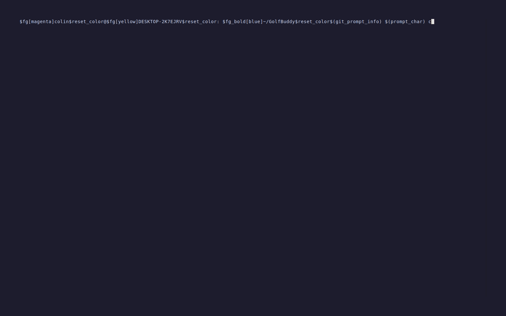

# GolfBuddy

> A golf scorecard tracking app with a terminal UI. Scan scorecards via Gemini OCR, browse player stats, view and edit rounds — all from the terminal.




## How It Works

```
Scorecard photo
      │
      ▼
  Gemini OCR          ← google-genai
      │
      ▼
  FastAPI server      ← starts automatically in background
      │
      ▼
  Go TUI              ← Bubbletea + Lipgloss
  ├── scan: review & edit extracted scores
  ├── stats: browse players, rounds, aggregates
  └── nuke: reset database
      │
      ▼
  SQLite (SQLAlchemy)
```

## Features

- Scorecard scanning via Gemini 2.5 Flash (multi-player support)
- Interactive TUI: scan, review, edit, and save scorecards without leaving the terminal
- Stats browser: browse players, view round history, open any round's scorecard
- SQLite database via SQLAlchemy
- REST API (FastAPI) started automatically in the background

## Quick Start

### Prerequisites

- Python 3.12+
- Go 1.21+
- `GEMINI_API_KEY` environment variable set

### Install dependencies

```bash
python3 -m venv golf_buddy_env
source golf_buddy_env/bin/activate
pip install -r requirements.txt
```

### Run the TUI

```bash
cd tui
go mod tidy   # first time only
go run .
```

The API server starts automatically in the background when the TUI launches.

## TUI Navigation

| Key | Action |
|-----|--------|
| `↑/↓` or `j/k` | Navigate lists and menus |
| `Enter` | Select / confirm |
| `Esc` | Go back |
| `q` | Quit (from most screens) |
| `e` | Enter edit mode (scorecard cells) |
| `s` | Save scorecard |
| `Tab` | Autocomplete file path (input screen) |

## TUI Menu

### scan
Scan a scorecard from an image or a pre-parsed JSON file.

- **image** — send image to Gemini, review the extracted scorecard in the TUI table editor, then save
- **json** — load a pre-parsed JSON file directly into the table editor (useful for testing without hitting Gemini)

After scanning, the scorecard table lets you navigate cells with arrow keys, edit any value, and press `s` to save.

### stats
Browse all players. Select a player to see their round history and aggregate stats. Select a round to view its full scorecard. Press `e` to edit scores and `s` to save changes back to the database.

### nuke
Delete all data and recreate the database schema. Requires typing `yes` to confirm.

## Project Structure

```
GolfBuddy/
├── src/
│   ├── core/           # SQLAlchemy engine and ORM models
│   ├── database/       # CLI-facing mirrors of src/core/ (same DB)
│   ├── api/            # FastAPI application (server.py used at runtime)
│   └── ocr/            # Gemini pipeline and DB save utilities
├── tools/
│   └── analytics.py    # Round summary formatting
├── tui/
│   ├── main.go         # Entry point — starts API server + TUI
│   ├── model.go        # Bubbletea model, state machine, menus
│   ├── scorecard.go    # Scorecard table editor (scan flow)
│   ├── stats.go        # Stats browser (player list, round view)
│   └── styles.go       # Lipgloss styles
├── scan.py             # Python CLI for scanning scorecards
├── main.py             # Python CLI entry point (api / stats / nuke)
└── requirements.txt
```

## API Endpoints

The API starts automatically when the TUI runs. It can also be started manually:

```bash
python main.py api   # http://localhost:8000
```

| Method | Path | Description |
|--------|------|-------------|
| GET | `/users` | List all users |
| GET | `/users/{username}` | User detail and aggregate stats |
| GET | `/scorecards/{username}` | All rounds for a user |
| GET | `/scorecards/{username}/{id}` | Full scorecard with per-hole breakdown |
| PUT | `/scorecards/{id}` | Update scores for an existing round |
| GET | `/stats/{username}` | Aggregated stats (avg, best, worst, handicap) |
| GET | `/stats/{username}?days=N` | Stats filtered to last N days |

Interactive docs: `http://localhost:8000/docs`

## Tech Stack

- **OCR**: Gemini 2.5 Flash (`google-genai`)
- **API**: FastAPI, Uvicorn
- **Database**: SQLite via SQLAlchemy
- **TUI**: Go, Bubbletea, Lipgloss

## License

MIT — see [LICENSE](LICENSE)
